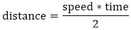
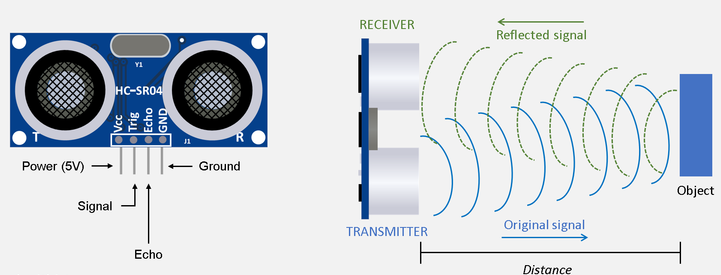
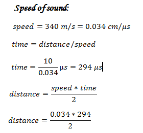
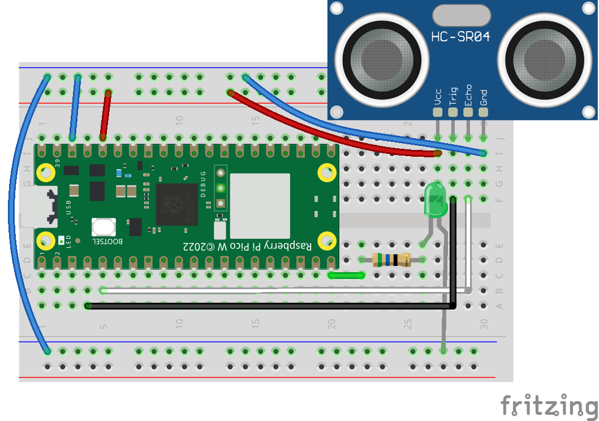

# HC-SR04 
 </img>
## UltraSonic   
The Ultra Sonic HC-SR04 emits ultrasound at 40,000Hz that travels in the air. If there is an object or obstacle in its path, then it collides and bounces back to the Ultra Sonic module.  
The formula `distance = speed*time` is used to calculate the distance.  
The distance between Ultra Sonic HC-SR04 and an object is:  
 
</img>
</img>  
 
Suppose, an object is placed at a distance of 10 cm away from the sensor, the speed of sound in air is 340 m/s or 0.034 cm/µs. It means the sound wave needs to travel in 294 µs. But the Echo pin double the distance (forward and bounce backward distance). So, to get the distance in cm multiply the received travel time value with echo pin by 0.034 and divide it by 2.  
</img>  
## Hardware Requirements
1. Half-Breadboard
2. Raspberry Pico W
3. HC-SR04
4. Jumper Wire
5. **56Ω** Resistor
6. Green LED
## Software Requirements
1. **Thonny**
## Setup Code
**Step1** : Connect Raspberry Pico W to Your Computer  
**Step2** : Install `mqutt.simple` Library in Thonny  
**Step3** : Config **#WIFI**  
**Step4** : Config **#MQTT Basic**  
**Step5** : Program Raspberry Pico W  
**Step6** : Connect Raspberry to BreadBoard  
**Step7** : Connect Wires Like Schematic  
**Step8** : Connect Raspberry To Power  
## Schematic
</img>
<a href="https://github.com/parsa-black/IOT-Laboratory/raw/master/RP%20Pico/Ultrasonic/Files/HC-SR04.fzz"></img></a>  
