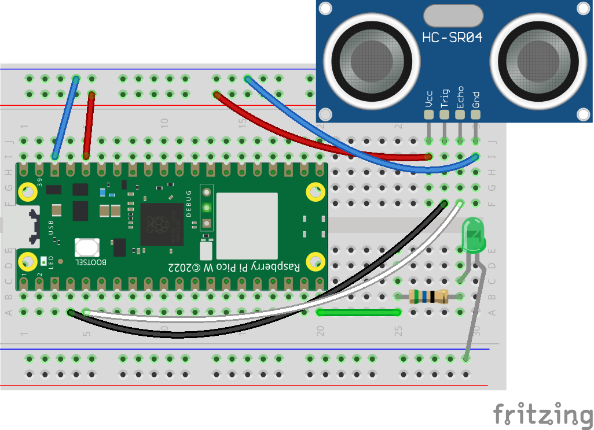

# HC-SRF04 
 </img>
UltraSonic (Distance Sensor)   
Step1 : Connect Raspberry Pico W to Your Computer  
Step2 : Install mqutt.simple in Thonny  
Step3 : Config **#WIFI**  
Step4 : Config **#MQTT Basic**  
Step5 : Program Raspberry Pico W  
Step6 : Connect Raspberry to BreadBoard  
Step7 : Connect Wires Like Schematic  
Step8 : Connect Raspberry To Power  

</img>  
[Download Fritzing](https://github.com/parsa-black/IOT-Laboratory/raw/master/RP%20Pico/Ultrasonic/Files/HC-SRF04.fzz)
